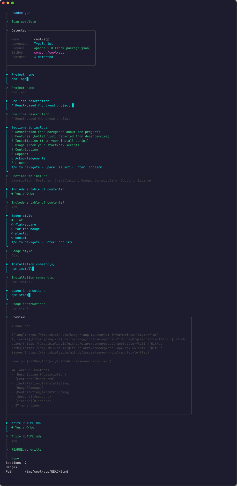

# readme-gen

A terminal wizard that writes a `README.md` for your project by scanning it — no AI, no API
keys, no network calls, no paid services. Everything it knows comes from files already on disk.



## What it does

Run it inside any project directory and it will:

- Scan `package.json` for the project name, description, scripts, dependencies and license field
- Read the actual `LICENSE` file (if there is one) and identify it from its text — MIT, Apache-2.0,
  GPL-2.0/3.0, LGPL-3.0, BSD-2/3-Clause, MPL-2.0, ISC and Unlicense are recognised. It no longer
  guesses from a random dependency's license or silently defaults to "MIT"
- Walk the project (skipping `node_modules`, `.git`, `dist`, `build` and similar) and detect
  languages by file extension
- Map known dependencies to feature bullets — Next.js, Nuxt, React, Vue, Svelte, Angular,
  Express, Fastify, NestJS, Koa, Supabase, Prisma, Mongoose, Sequelize, TypeORM, Postgres, MySQL,
  Socket.io, GraphQL, Tailwind, Electron, Vite, Webpack, Jest, Vitest, Mocha, ESLint, Prettier,
  TypeScript, nodemon and Docker
- Read the `origin` git remote (HTTPS or SSH) and, if it's GitHub, add stars/forks/issues badges
  and GitHub-flavoured Contributing/Support sections
- Walk you through an interactive wizard — edit the project name and description, tick which
  sections to include, pick a badge style, and set the install/usage commands — with everything
  pre-filled from what it detected, and a live preview before anything is written
- Ask before writing, and ask again before overwriting an existing `README.md`

## Installation

There is no published npm package. Clone and link it:

```bash
git clone https://github.com/ryjord/ReadMeGenerator.git
cd ReadMeGenerator
npm install
npm link
```

Then, from inside any project:

```bash
readme-gen
```

Or run it directly without linking:

```bash
node /path/to/ReadMeGenerator/bin/readme-gen.js
```

Requires Node 18.3 or newer.

## Usage

```bash
readme-gen              # interactive wizard
readme-gen --yes        # skip the wizard, write with detected defaults
readme-gen --dir path   # target a different directory
readme-gen --help
```

## What changed from v1

The previous version was a single 230-line file with one pointless prompt (it read your git
remote from `.git/config`, then made you type the same URL back and exited if they didn't
match — that guarded nothing) and several bugs that are now fixed:

- The license badge used to come from `Object.values(packages)[0]?.licenses` — the license of
  whichever *dependency* `license-checker` happened to return first — and fell back to `MIT` on
  any error, including projects with no license at all. It now reads your actual `LICENSE` file.
- The title used to come from the directory name, so a repo checked out into a differently-named
  folder got the wrong title. It now comes from `package.json`'s `name` field (still editable in
  the wizard).
- Language detection only looked at the top level of the project. It now walks the whole tree.
- The "Getting Started" and "Acknowledgements" sections were fixed boilerplate. Acknowledgements
  is now opt-in; Getting Started was dropped.
- The table of contents used to link to sections that could end up empty (e.g. "Features" with
  no detected dependencies), leaving dead anchors. It now only lists sections that actually
  rendered.

It's also a completely different interface: a single-file `inquirer` prompt replaced by a
multi-step [@clack/prompts](https://github.com/bombshell-dev/clack) wizard with colour, a scan
spinner, and a README preview before anything touches disk.

## License

MIT — see [LICENSE](LICENSE).
